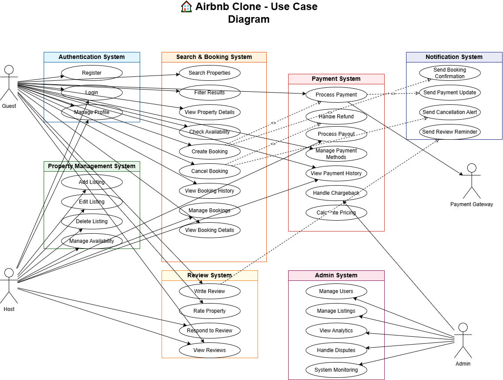

## Airbnb - clone Use case diagram

Objective: To visualize interactions using a use case diagram. 

A use case diagram to visualize the interactions between users and the system for key functionalities like user registration, property booking, and payments. 
All key actors and interactions are properly captured in the diagram. 
